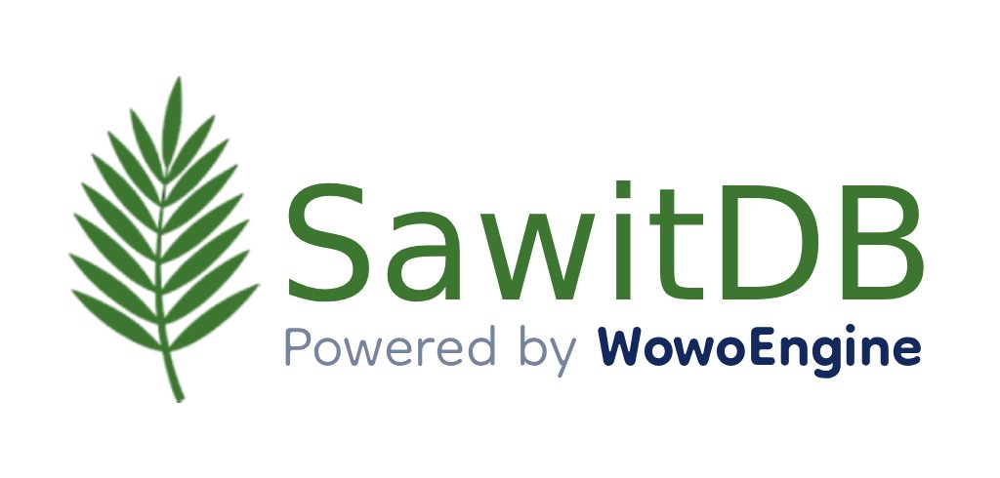

# SawitDB



<div align="center">

[](https://wowoengine.github.io/SawitDB/)
[](https://www.npmjs.com/package/@wowoengine/sawitdb)
[](https://github.com/WowoEngine/SawitDB-Go)
[](CHANGELOG.md)

</div>


**SawitDB** is a unique database solution stored in `.sawit` binary files.

The system features a custom **Hybrid Paged Architecture** similar to SQLite but supercharged with **Object Caching**, using fixed-size 4KB pages to ensure efficient memory usage and near-instant access. What differentiates SawitDB is its unique **Agricultural Query Language (AQL)**, which replaces standard SQL keywords with Indonesian farming terminology.

**Now available on NPM!** Connect via TCP using `sawitdb://` protocol.

**🚨 Emergency: Aceh Flood Relief**
Please support our brothers and sisters in Aceh.

[](https://kitabisa.com/campaign/donasipedulibanjiraceh)

*Organized by Human Initiative Aceh*

## Features

- **Hybrid Paged Architecture**: Data is stored in 4096-byte binary pages, but hot data is cached as native Objects for zero-copy reads.
- **Single File Storage**: All data, schema, and indexes are stored in a single `.sawit` file.
- **High Stability**: Uses 4KB atomic pages. More stable than a coalition government.
- **Data Integrity (Anti-Korupsi)**: Implements strict `fsync` protocols. Data cannot be "corrupted" or "disappear" mysteriously like social aid funds (Bansos). No "Sunat Massal" here.
- **Crash Recovery**: Uses **Write-Ahead Logging (WAL)**. Guarantees data always returns after a crash. Unlike a fugitive (Buronan) who is "hard to find".
- **Zero Bureaucracy (Zero Deps)**: Built entirely with standard Node.js. No unnecessary "Vendor Pengadaan" or "Mark-up Anggaran".
- **Transparansi**: Query language is clear. No "Pasal Karet" (Ambiguous Laws) or "Rapat Tertutup" in 5-star hotels.
- **Speed**: Faster than printing an e-KTP at the Kelurahan.
- **Network Support (NEW)**: Client-Server architecture with Multi-database support and Authentication.
- **NPM Support (NEW)**: Install via `npm install @wowoengine/sawitdb`.

## Filosofi

### Filosofi (ID)
SawitDB dibangun dengan semangat "Kemandirian Data". Kami percaya database yang handal tidak butuh **Infrastruktur Langit** yang harganya triliunan tapi sering *down*. Berbeda dengan proyek negara yang mahal di *budget* tapi murah di kualitas, SawitDB menggunakan arsitektur **Single File** (`.sawit`) yang hemat biaya. Backup cukup *copy-paste*, tidak perlu sewa vendor konsultan asing. Fitur **`fsync`** kami menjamin data tertulis di *disk*, karena bagi kami, integritas data adalah harga mati, bukan sekadar bahan konferensi pers untuk minta maaf.

### Philosophy (EN)
SawitDB is built with the spirit of "Data Sovereignty". We believe a reliable database doesn't need **"Sky Infrastructure"** that costs trillions yet goes *down* often. Unlike state projects that are expensive in budget but cheap in quality, SawitDB uses a cost-effective **Single File** (`.sawit`) architecture. Backup is just *copy-paste*, no need to hire expensive foreign consultants. Our **`fsync`** feature guarantees data is written to *disk*, because for us, data integrity is non-negotiable, not just material for a press conference to apologize.

## File List

- `src/WowoEngine.js`: Core Database Engine (Class: `SawitDB`).
- `bin/sawit-server.js`: Server executable.
- `cli/local.js`: Interactive CLI tool (Local).
- `cli/remote.js`: Interactive CLI tool (Network).
- [CHANGELOG.md](CHANGELOG.md): Version history and release notes.
- `cli/test.js`: Unit Test Suite.
- `cli/benchmark.js`: Performance Benchmark Tool.
- `examples/`: Sample scripts.

## Installation

Install via NPM:

```bash
npm install @wowoengine/sawitdb
```

## Quick Start (Network Edition)

### 1. Start the Server
```bash
node src/SawitServer.js
```
The server will start on `0.0.0.0:7878` by default.

### 2. Connect with Client
Use [SawitClient](#client-api) or any interactive session.

---

## Dual Syntax Support

SawitDB introduces the **Generic Syntax** alongside the classic **Agricultural Query Language (AQL)**, making it easier for developers familiar with standard SQL to adopt.

| Operation | Agricultural Query Language (AQL) | Generic SQL (Standard) |
| :--- | :--- | :--- |
| **Create DB** | `BUKA WILAYAH sales_db` | `CREATE DATABASE sales_db` |
| **Use DB** | `MASUK WILAYAH sales_db` | `USE sales_db` |
| **Show DBs** | `LIHAT WILAYAH` | `SHOW DATABASES` |
| **Drop DB** | `BAKAR WILAYAH sales_db` | `DROP DATABASE sales_db` |
| **Create Table** | `LAHAN products` | `CREATE TABLE products` |
| **Insert** | `TANAM KE products (...) BIBIT (...)` | `INSERT INTO products (...) VALUES (...)` |
| **Select** | `PANEN * DARI products DIMANA ...` | `SELECT * FROM products WHERE ...` |
| **Update** | `PUPUK products DENGAN ...` | `UPDATE products SET ...` |
| **Delete** | `GUSUR DARI products DIMANA ...` | `DELETE FROM products WHERE ...` |
| **Indexing** | `INDEKS products PADA price` | `CREATE INDEX ON products (price)` |
| **Aggregation** | `HITUNG SUM(stock) DARI products` | *Same Syntax* |

---

## Query Syntax (Detailed)

### 1. Management Commands

#### Create Table
```sql
-- Tani
LAHAN users
-- Generic
CREATE TABLE users
```

#### Show Tables
```sql
-- Tani
LIHAT LAHAN
-- Generic
SHOW TABLES
```

#### Drop Table
```sql
-- Tani
BAKAR LAHAN users
-- Generic
DROP TABLE users
```

### 2. Data Manipulation

#### Insert Data
```sql
-- Tani
TANAM KE users (name, role) BIBIT ('Alice', 'Admin')
-- Generic
INSERT INTO users (name, role) VALUES ('Alice', 'Admin')
```

#### Select Data
```sql
-- Tani
PANEN name, role DARI users DIMANA role = 'Admin' ORDER BY name ASC LIMIT 10
-- Generic
SELECT name, role FROM users WHERE role = 'Admin' ORDER BY name ASC LIMIT 10
```
*Operators*: `=`, `!=`, `>`, `<`, `>=`, `<=`
*Advanced*: `IN ('a','b')`, `LIKE 'pat%'`, `BETWEEN 10 AND 20`, `IS NULL`, `IS NOT NULL`

#### Pagination & Sorting
```sql
SELECT * FROM users ORDER BY age DESC LIMIT 5 OFFSET 10
SELECT * FROM users WHERE age BETWEEN 18 AND 30 AND status IS NOT NULL
```

#### Update Data
```sql
-- Tani
PUPUK users DENGAN role='SuperAdmin' DIMANA name='Alice'
-- Generic
UPDATE users SET role='SuperAdmin' WHERE name='Alice'
```

#### Delete Data
```sql
-- Tani
GUSUR DARI users DIMANA name='Bob'
-- Generic
DELETE FROM users WHERE name='Bob'
```

### 3. Advanced Features

#### Indexing
```sql
INDEKS [table] PADA [field]
-- or
CREATE INDEX ON [table] ([field])
```

#### Aggregation & Grouping
```sql
HITUNG COUNT(*) DARI [table]
HITUNG AVG(price) DARI [products] KELOMPOK [category]
-- Generic Keyword Alias
SELECT AVG(price) FROM [products] GROUP BY [category] (Coming Soon)
```

## Architecture Details

- **Modular Codebase**: Engine logic separated into `src/modules/` (`Pager.js`, `QueryParser.js`, `BTreeIndex.js`) for better maintainability.
- **Page 0 (Master Page)**: Contains header and Table Directory.
- **Data & Indexes**: Stored in 4KB atomic pages.

## Benchmark Performance
Test Environment: Single Thread, Windows Node.js (Local NVMe)

| Operation | Ops/Sec | Latency (avg) |
|-----------|---------|---------------|
| **INSERT** | ~22,000 | 0.045 ms |
| **SELECT (PK Index)** | **~247,288** | 0.004 ms |
| **SELECT (Scan)** | ~13,200 (10k rows) | 0.075 ms |
| **UPDATE (Indexed)** | ~11,000 | 0.090 ms |
| **DELETE (Indexed)** | ~19,000 | 0.052 ms |

*Note: Hasil dapat bervariasi tergantung hardware.*

## Full Feature Comparison

| Feature | Tani Edition (AQL) | Generic SQL (Standard) | Notes |
|---------|-------------------|------------------------|-------|
| **Create DB** | `BUKA WILAYAH [db]` | `CREATE DATABASE [db]` | Creates `.sawit` in data/ |
| **Use DB** | `MASUK WILAYAH [db]` | `USE [db]` | Switch context |
| **Show DBs** | `LIHAT WILAYAH` | `SHOW DATABASES` | Lists available DBs |
| **Drop DB** | `BAKAR WILAYAH [db]` | `DROP DATABASE [db]` | **Irreversible!** |
| **Create Table** | `LAHAN [table]` | `CREATE TABLE [table]` | Schema-less creation |
| **Show Tables** | `LIHAT LAHAN` | `SHOW TABLES` | Lists tables in DB |
| **Drop Table** | `BAKAR LAHAN [table]` | `DROP TABLE [table]` | Deletes table & data |
| **Insert** | `TANAM KE [table] ... BIBIT (...)` | `INSERT INTO [table] (...) VALUES (...)` | Auto-ID if omitted |
| **Select** | `PANEN ... DARI [table] DIMANA ...` | `SELECT ... FROM [table] WHERE ...` | Supports Projection |
| **Update** | `PUPUK [table] DENGAN ... DIMANA ...` | `UPDATE [table] SET ... WHERE ...` | Atomic update |
| **Delete** | `GUSUR DARI [table] DIMANA ...` | `DELETE FROM [table] WHERE ...` | Row-level deletion |
| **Index** | `INDEKS [table] PADA [field]` | `CREATE INDEX ON [table] (field)` | B-Tree Indexing |
| **Count** | `HITUNG COUNT(*) DARI [table]` | `SELECT COUNT(*) FROM [table]` (via HITUNG) | Aggregation |
| **Sum** | `HITUNG SUM(col) DARI [table]` | `SELECT SUM(col) FROM [table]` (via HITUNG) | Aggregation |
| **Average** | `HITUNG AVG(col) DARI [table]` | `SELECT AVG(col) FROM [table]` (via HITUNG) | Aggregation |

### Supported Operators Table

| Operator | Syntax Example | Description |
|----------|----------------|-------------|
| **Comparison** | `=`, `!=`, `>`, `<`, `>=`, `<=` | Standard value comparison |
| **Logical** | `AND`, `OR` | Combine multiple conditions |
| **In List** | `IN ('coffee', 'tea')` | Matches any value in the list |
| **Not In** | `NOT IN ('water')` | Matches values NOT in list |
| **Pattern** | `LIKE 'Jwa%'` | Standard SQL wildcard matching |
| **Range** | `BETWEEN 1000 AND 5000` | Inclusive range check |
| **Null** | `IS NULL` | Check if field is empty/null |
| **Not Null** | `IS NOT NULL` | Check if field has value |
| **Limit** | `LIMIT 10` | Restrict number of rows |
| **Offset** | `OFFSET 5` | Skip first N rows (Pagination) |
| **Order** | `ORDER BY price DESC` | Sort by field (ASC/DESC) |
## License

MIT License
<!-- ## Support Developer
- [](https://saweria.co/patradev)

- **BTC**: `12EnneEriimQey3cqvxtv4ZUbvpmEbDinL`
- **BNB Smart Chain (BEP20)**: `0x471a58a2b5072cb50e3761dba3e15d19f080bdbc`
- **DOGE**: `DHrFZW6w9akaWuf8BCBGxxRLR3PegKTggF` -->
